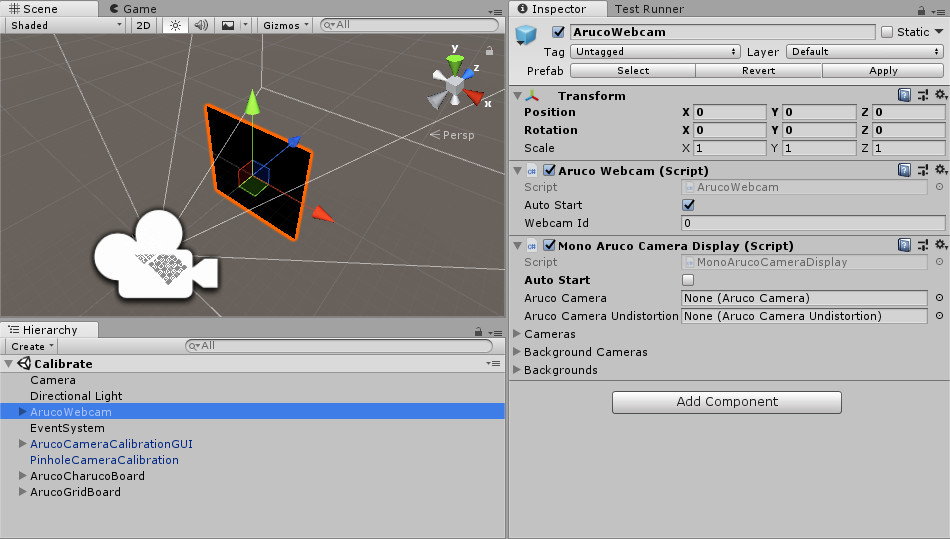
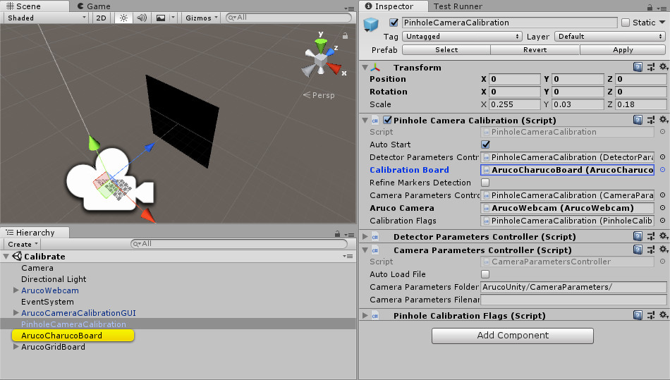
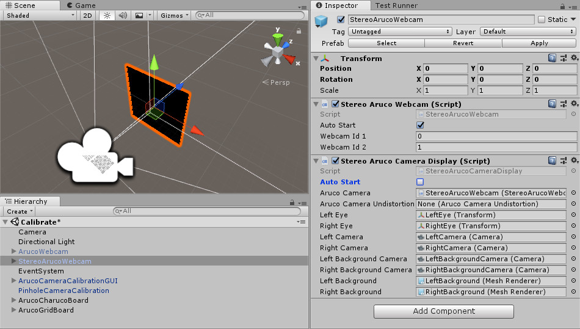

# Calibrate a Camera

## Motivation

In order to be able to track markers you need to calibrate your camera, i.e. measure the camera parameters.

The calibration process may seems long but it's only because there is lots of customization options. The principle is straightforward: (1) print a calibration board and (2) take images with your camera of the board in different positions and orientations. Aruco Unity will generate XML file containing the camera parameters.

To understand the algorithms used, read these tutorials: [Calibration with ArUco and ChArUco](https://docs.opencv.org/master/da/d13/tutorial_aruco_calibration.html) and [Camera calibration With OpenCV](https://docs.opencv.org/master/d4/d94/tutorial_camera_calibration.html).

## Calibrate a camera

Most of the cameras we use today on our smartphones or laptops are called in Aruco Unity pinhole cameras (camera using a [rectilinear lens](https://en.wikipedia.org/wiki/Rectilinear_lens)) in contrast with cameras using a [fisheye lens](https://en.wikipedia.org/wiki/Fisheye_lens). So if you want to calibrate your webcam or smartphone, read this section.

- Make a calibration board.
  1. Create a charuco board or a grid board. See the [Create Markers](https://github.com/NormandErwan/ArucoUnity/wiki/1.-Create-Markers) wiki page for details.
  2. Print the generated image on paper. Stick it on a hard cardboard: the paper must remains as flat as possible during the calibration (*Fig.1*).

*Fig.1: Different viewpoints of a charuco calibration board. From OpenCV: [https://docs.opencv.org/master/da/d13/tutorial_aruco_calibration.html](https://docs.opencv.org/master/da/d13/tutorial_aruco_calibration.html)*

- Open the `Assets/ArucoUnity/Scenes/Calibrate.unity` scene.
- Configure the `ArucoWebcam` game object (*Fig.2*).
  - Set the `WebcamId` to select the camera you want to use. The first camera's id is `0`. You can list the available webcams with [WebCamTexture.devices](https://docs.unity3d.com/ScriptReference/WebCamTexture-devices.html).
  - `MonoArucoCameraDisplay.AutoStart` is uncheck because the video stream is displayed by the `ArucoCameraCalibrationGUI` object.

*Fig.2: Default configuration of `ArucoWebcam` using the first webcam (id=`0`).*

- Configure the calibration board on the `PinholeCameraCalibration` game object (*Fig.3*).
  - Set the `CalibrationBoard` with a charuco board or a grid board. Both are already created in the scene to help you.
  - Configure the calibration board object by measuring the one you just printed. Units are in meters. The `ArucoObjectDisplayer` helps you visualize the configured board to see if it's match with the printed one. Don't switch x and y values.
- Optionally adjust parameters on the `PinholeCameraCalibration` game object.
  - Set the output camera parameters file with `CameraParametersController`. The folder is relative to [persistentDataPath](https://docs.unity3d.com/ScriptReference/Application-persistentDataPath.html) in builds or to the "Asset" folder of your projet in the editor. If the filename is empty, it will be automatically generated from the Aruco camera used.
  - Configure the board detection with `DetectorParametersController` parameters. They are described on the Detector Parameters section of the [ArUco camera calibration tutorial](https://docs.opencv.org/master/d5/dae/tutorial_aruco_detection.html).
  - Configure the calibration flags with `PinholeCameraCalibrationFlags`. They are described on the [calib3d::calibrateCamera() function](https://docs.opencv.org/master/d9/d0c/group__calib3d.html#ga3207604e4b1a1758aa66acb6ed5aa65d) documentation.

*Fig.3: `PinholeCameraCalibration` configured with a charuco board.*

- Run the scene and interact with the UI to calibrate your camera (*Fig.4*).
  1. Hold the calibration board in front of your camera and click on the `Add Image` button. Think to deactivate the autofocus of your camera: a calibration is done for only one focal length at the time.
  2. Take at least 10 images of you calibration board in different positions and orientations without moving the camera between each snapshot. See this [example of images](https://upload.wikimedia.org/wikipedia/commons/0/05/Multiple_chessboard_views.png).
  3. Reset the image list if you want to start over with the `Reset` button.
  4. Calibrate your camera with the image list with the `Calibrate` button. The reprojection error is displayed to score the calibration precision: it should be close to 0 px. Read the responses of this [stackoverflow question](https://stackoverflow.com/q/12794876) to improve your calibrations.

*Fig.4: Calibration scene running.*

## Calibrate a stereoscopic camera

The process is the same as in the [Calibrate a camera](https://github.com/NormandErwan/ArucoUnity/wiki/2.-Calibrate-a-Camera/_edit#calibrate-a-camera) section but we use differents camera and calibration scripts.

- Make a calibration board.
- Open the `Assets/ArucoUnity/Scenes/CalibrateCamera.unity` scene.
- Configure the camera.
   1. Deactivate the `ArucoWebcam` game object.
   2. Drag `Assets/ArucoUnity/Prefabs/Cameras/StereoArucoWebcam.prefab` into the scene.
   3. Set `StereoArucoWebcam.WebcamId1`, `StereoArucoWebcam.WebcamId2` and uncheck `StereoArucoCameraDisplay.AutoStart` (*Fig.5*).

*Fig.5: Stereo webcam configured to use the first (id1=`0`) and the second webcam (id2=`1`)*

- Configure the calibration.
  1. Deactivate the `PinholeCameraCalibration` game object.
  2. Drag `Assets/ArucoUnity/Prefabs/Calibration/StereoPinholeCameraCalibration.prefab` into the scene.
  3. Set `StereoPinholeCameraCalibration.ArucoCamera` with `StereoArucoWebcam` (*Fig.6*).
  4. Set `ArucoCameraCalibrationGUI.ArucoCameraCalibration` with `StereoPinholeCameraCalibration` (*Fig.7*).
  5. Optionally adjust detection and calibration parameters.

*Fig.6: `StereoPinholeCameraCalibration` configured with a charuco board.*

*Fig.7: `ArucoCameraCalibrationGUI` configured with `StereoPinholeCameraCalibration`.*

- Run the scene and calibration your camera (*Fig.8*).

*Fig.8: Calibration scene running.*

## Calibrate a fisheye camera

Follow the [Calibrate a stereoscopic camera](#calibrate-a-stereoscopic-camera) section but use `OmnidirCameraCalibration` prefab for a monoscopic camera or `StereoOmnidirCameraCalibration` prefab for a stereoscopic camera.

The algorithms used are described in this tutorial: [Calibration with ArUco and ChArUco](https://docs.opencv.org/master/da/d13/tutorial_aruco_calibration.html).

## Reuse calibration data

You may already have calibrated your camera and want to directly reuse your calibration data. Aruco Unity doesn't use the YAML format used by OpenCV to store these data but use XML files. Therefore you need to create by hand calibration file for Aruco Unity.

Make a copy of `Assets/ArucoUnity/CameraParameters/<CameraType>Example.xml` and transfer your calibration data.