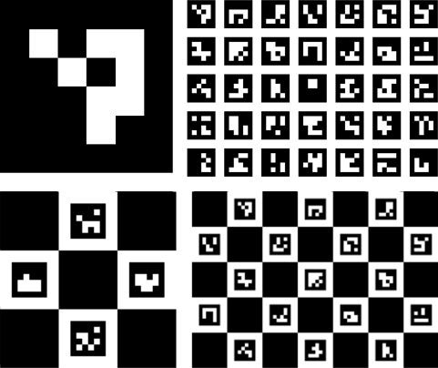
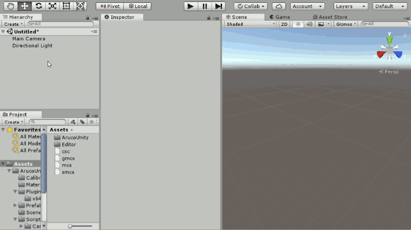
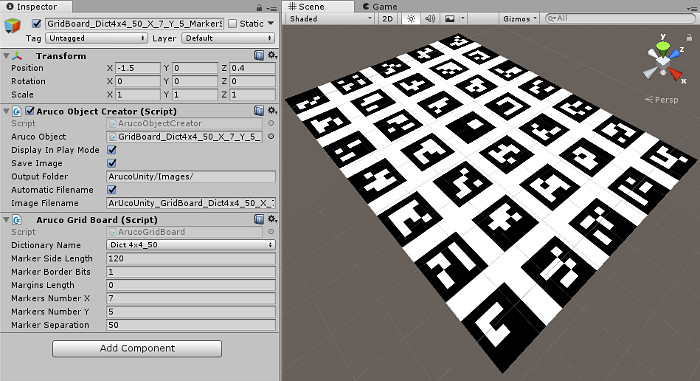
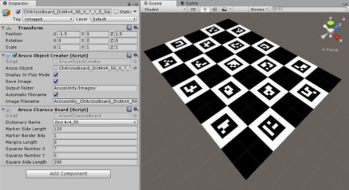
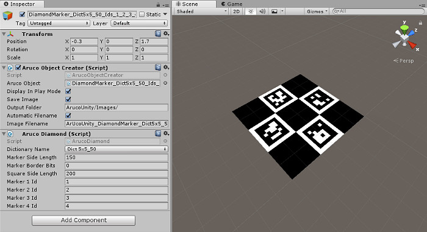

# Create Markers

## Motivation

Before tracking markers with your camera, you need to create, print and place them in the environment. You can use four type of ArUco objects: [markers](https://docs.opencv.org/master/d5/dae/tutorial_aruco_detection.html), [grid boards](https://docs.opencv.org/master/db/da9/tutorial_aruco_board_detection.html), [charuco boards](https://docs.opencv.org/master/df/d4a/tutorial_charuco_detection.html) and [diamond markers](https://docs.opencv.org/master/d5/d07/tutorial_charuco_diamond_detection.html).

*From left to right: a marker, a diamond marker, a grid board, a charuco board.*

## `CreateMarkers` scene

Open the `Assets/ArucoUnity/Scenes/CreateMarkers.unity` scene to visualize the ArUco objects. Play this scene to create them. You can find the created images in `Assets/ArucoUnity/Images/`.

## Manual creation

### Marker

*Manual creation and configuration of a marker.*

1. Create an empty object.
2. Add a `ArucoMarker` script. Configure it:
     - Select a dictionary of markers. It determines the marker size (for example 4x4 bits) and had a size (for example 50 markers). A lower dictionary size is better to avoid detection errors. For more details, see "Markers and Dictionaries" and "Selection a dictionary" sections of this [tutorial](https://docs.opencv.org/master/d5/dae/tutorial_aruco_detection.html).
     - Set `MarkerSideLength` in pixels. It controls the image size.
     - Set `MarkerBorderBits` with a minimum of 1. It controls the width of the black border of the marker, helping its detection.
     - Set `MarkerId`, from 0 to the dictionary size.
3. Add a `ArucoObjectCreator` script. Configure it:
     - Add the `ArucoMarker` script to the `ArucoObject` field.
     - Check `DisplayInPlayMode` if you want to display the marker in play mode.
     - Check `SaveImage` to save the marker in an image file in play mode.
     - Set the `OutputFolder` path to save the image, relative to the [persistentDataPath](https://docs.unity3d.com/ScriptReference/Application-persistentDataPath.html) in builds or to the "Assets" folder of your project in the editor.
     - Check `AutomaticFilename` for an automatic image filename based on the `ArucoObject` property values.
     - Set the image filename in `OptionalImageFilename` if `AutomaticFilename` is not checked.
4. Play the scene. The marker is automatically created on a child plane of our object and saved on the project folder.

### Grid board

*Example of a grid board with the corresponding configuration.*

The process is the same as in the [marker](#marker) subsection.

The additional configurable parameters are:

- `MarkersNumberX`: The number of markers on the board X axis.
- `MarkersNumberY`: The number of markers on the board Y axis.
- `MarkerSeparation`: The margin between markers in pixels.

### Charuco board

*Example of a charuco board with the corresponding configuration.*

The process is the same as in the [marker](#marker) subsection.

The additional configurable parameters are:

- `MarginLength`: The markers margin on the white squares.
- `SquaresNumberX`: The number of squares on the board X axis.
- `SquaresNumberY`: The number of squares on the board Y axis.
- `SquareSideLength`: The width in pixels of each square.

### Diamond marker

*Example of a diamond marker with the corresponding configuration.*

The process is the same as in the [marker](#marker) subsection.

The additional configurable parameters are:

- `SquareSideLength`: The width in pixels of each square.
- `MarkersXId`: The ids of the four markers.