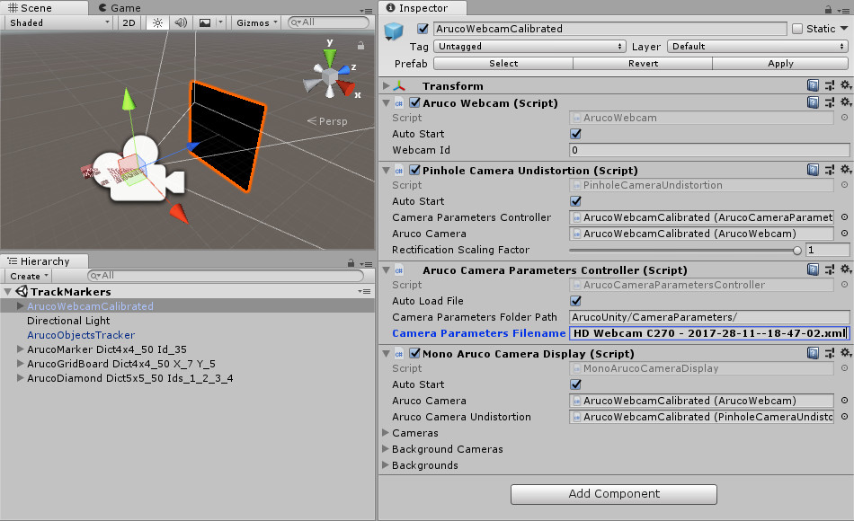
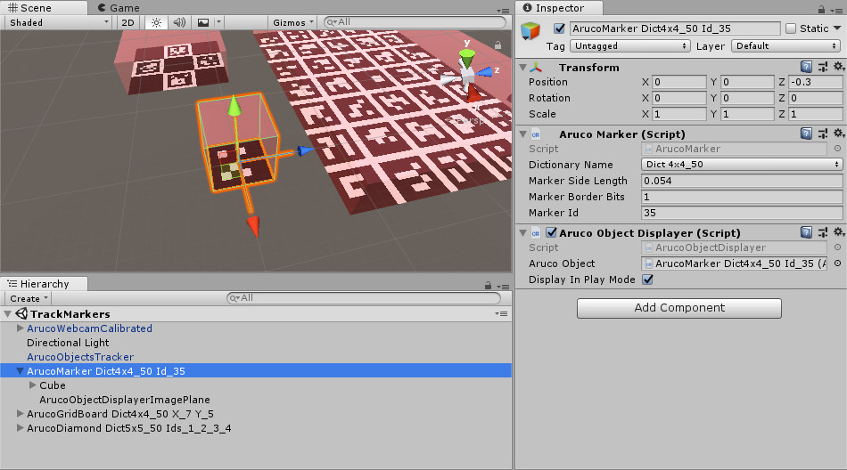
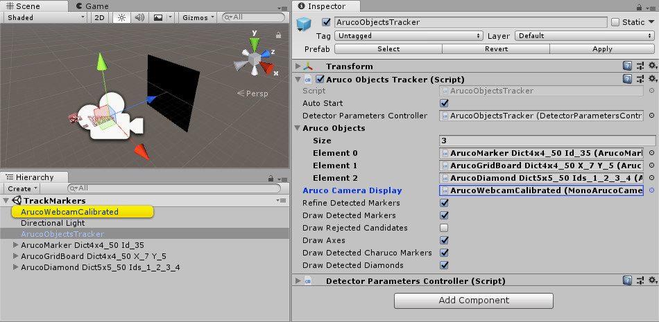

# Track Markers

First, make sure you have calibrated your camera: read the [Calibrate a Camera](calibrate-a-camera.html) page.

- Create, print and place in the environment the aruco objects you want to track. Read the [Create Markers](create-markers.html) page for details.
- Open the `Assets/ArucoUnity/Scenes/TrackMarkers.unity` scene.
- Configure the camera:
  1. For a webcam, use the `ArucoWebcamCalibrated` object already in the scene. Otherwise, drag the prefab corresponding to your camera : `Assets/ArucoUnity/Prefabs/Cameras/<CameraType>Calibrated.prefab`.
  2. Fill `CameraParametersFilename` with the camera parameters XML file from the calibration of the camera (*Fig.1*).

*Fig.1: `ArucoWebcamCalibrated` configured with camera parameters from a calibration.*

- Create each aruco objects to track:
  - Configure it with what you measure on the printed aruco object. Units are in meters for tracking, not in pixels.
  - Use a `ArucoObjectDisplayer` to visualize the aruco object, not a ArucoObjectCreator.
  - Simply add any game object as child of the aruco object e.g. the red cube in *Fig.2*.

*Fig.2: `ArucoMarker` configured to track a physical aruco marker with a 5.4 cm side length. The `ArucoObjectDisplayer` helps to visualize in the editor the physical object that will be tracked.*

- Configure the tracker `ArucoObjectsTracker`:
  1. Drag all the aruco objects to track in `ArucoObjects`.
  2. Set `ArucoCameraDisplay` with the camera prefab you use (*Fig.3*).

*Fig.3: `ArucoObjectsTracker` configured to track three objects for the `ArucoCameraCalibrated` we configured.*

- Run the scene! The `ArucoTracker` will place (position, rotation, scale) any detected aruco object in the `ArucoObjects` list relative to the camera (*Fig.4*).

*Fig.4: [Roll a ball](https://unity3d.com/fr/learn/tutorials/s/roll-ball-tutorial) set as child of an aruco board: the game follows the board movements.*

To understand the algorithm used, read this tutorial: [Detection of ArUco Markers](https://docs.opencv.org/3.4/d5/dae/tutorial_aruco_detection.html).